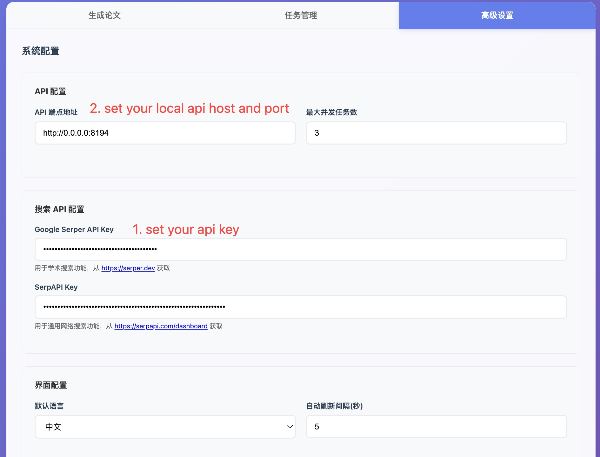
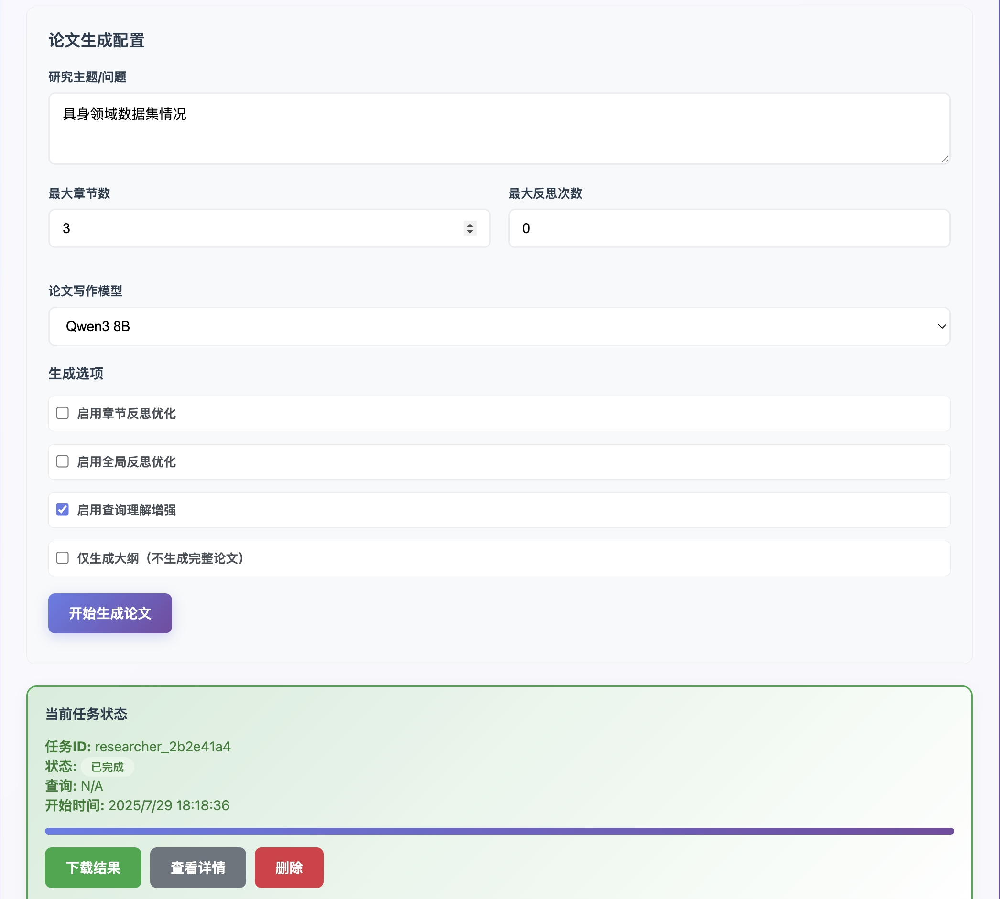

# SciSage

This is the official repo of Scisage.

📄 **Paper**: https://arxiv.org/abs/2506.12689

📊 **Benchmark**: https://huggingface.co/datasets/BAAI/SurveyScope

## Features

- **Multi-source Paper Extraction**: Robust crawling from arXiv with fallback mechanisms
- **Intelligent Analysis**: AI-powered paper understanding and outline generation
- **Structured Content Generation**: Section-wise detailed analysis with proper citations
- **Multi-model Support**: Compatible with GPT-4, local models, and cloud services


## Quick Start

### 1. Installation

```bash
git clone https://github.com/FlagOpen/SciSage.git
cd SciSage
pip install -r requirements.txt
```

### 2. Configuration

#### Model Setup

Edit [`core/model_factory.py`](core/model_factory.py):

```python
llm_map = {
    "gpt-4": AzureChatOpenAI(...),
    "gpt-4o-mini": AzureChatOpenAI(...),
}
```

#### Pipeline Settings

Edit [`core/configuration.py`](core/configuration.py)  and set your Default model you want to use.

### 3. Run pipeline

```bash
1. cd core
2. SET YOUR SEARCH API KEY, IF YOUR WANT YOUR YOUR LOCAL MODEL, SET THE ENVIRONMENT:
3. bash run.sh
```

### 4. Run local demo

```
bash run_demo.sh
```





## Project Structure

```
SciSage/
├── benchmark/              # Paper extraction tools
│   └── get_paper_info.py   # Multi-source paper crawler for benchmark build
├── core/                   # Analysis pipeline
│   ├── main_workflow_opt_for_paper.py  # Main orchestrator
│   ├── paper_outline_opt.py            # Outline generation
│   ├── paper_poolish_opt.py            # Content polishing
│   ├── model_factory.py                # Model management
│   └── configuration.py                # Settings
└── eval/                   # Evaluation tools
```

## License

MIT License - see LICENSE file for details.
